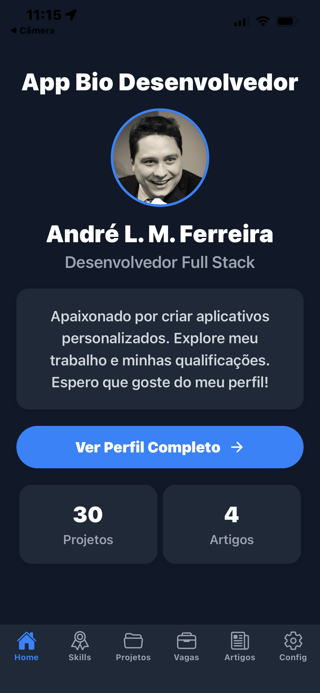
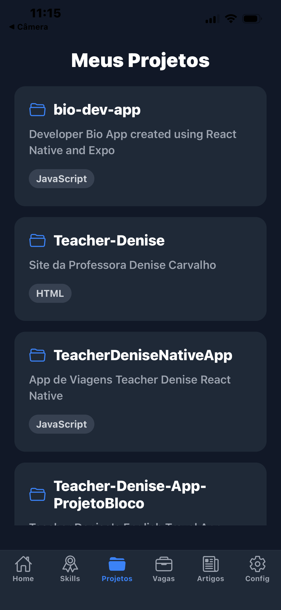
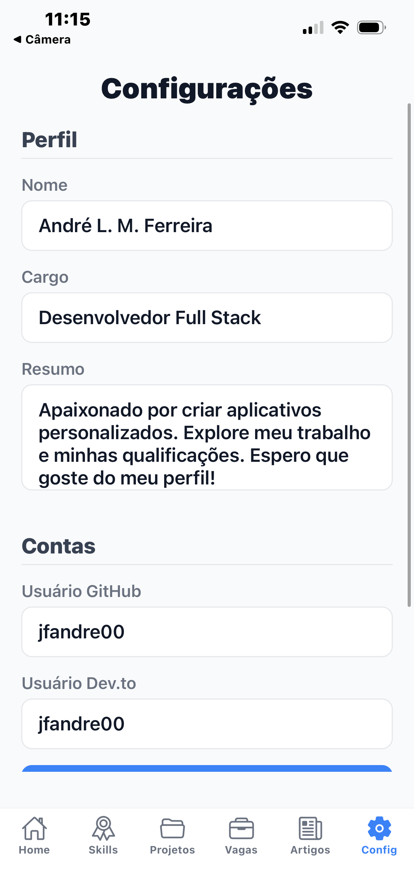

# 👨‍💻 Developer Bio - React Native App

This is a complete developer portfolio/bio application, built with **React Native** and **Expo**.  
The project was developed iteratively through 16 exercises covering everything from initial architecture to API consumption, global state management, local storage, and styling with a dynamic theme (light/dark).  

---

## ✨ Features

- **Complete Navigation:** Uses Stack and Bottom Tab Navigators for a smooth experience.  
- **Dynamic Profile:** Home and Profile screens display developer information.  
- **Real API Consumption:**  
  - Project list fetched directly from the **GitHub API**.  
  - Article list fetched from the **Dev.to API**.  
- **Global State Management:** React’s Context API is used to manage user data and the app theme.  
- **Data Persistence:** **AsyncStorage** is used to save the app history, preserving data even after the app is closed.  
- **Dynamic Theme:** A settings screen allows switching between **light** and **dark mode** across the entire app.  
- **WebView:** Articles open within the app for an integrated reading experience.  
- **Organized Code:** Modular folder structure (`screens`, `contexts`, `navigation`, `styles`) to facilitate maintenance and scalability.  

---

## 🚀 Technologies Used

- [React Native](https://reactnative.dev/)  
- [Expo](https://expo.dev/)  
- [React Navigation](https://reactnavigation.org/)  
- [AsyncStorage](https://react-native-async-storage.github.io/async-storage/)  
- **JavaScript (ES6+)**  
- [Context API](https://react.dev/reference/react/Context)  

---

## 📸 App Screenshots

- **Home Screen (Light)**  
    

- **Projects Screen (Dark)**  
    

- **Settings Screen**  
    


---

## 🛠️ How to Run the Project

### Prerequisites
- [Node.js (LTS)](https://nodejs.org/)  
- [Git](https://git-scm.com/)  
- Expo CLI (`npm install -g expo-cli`)  
- **Expo Go** app on your smartphone (iOS or Android)  

### Steps
```bash
# Clone the repository
git clone https://github.com/your-username/your-repository.git

# Navigate to the project folder
cd your-repository

# Install dependencies
npm install

# Start the Expo development server
expo start

# Open on your phone:
- Scan the QR code displayed in the terminal with the Expo Go app.